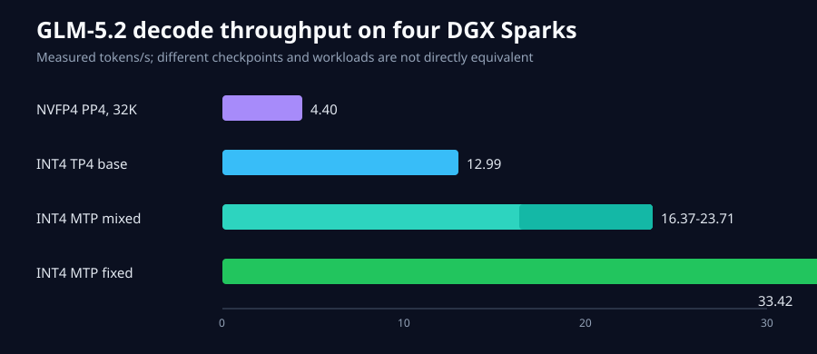

# Four DGX Sparks, one direct ring, no switch

Reproducible GLM and Qwen inference on four NVIDIA DGX Spark systems connected
as a direct ConnectX ring. This repository publishes only configurations and
results that were exercised on the four-node ring. It does not ship model
weights or modify host management networking.



## Tested results

| Checkpoint | Layout | Context | Stable decode | Result |
| --- | --- | ---: | ---: | --- |
| `QuantTrio/GLM-5.2-Int4-Int8Mix` | TP=4 | 8,192 | 12.99 tok/s | passed and restored |
| same checkpoint, MTP=4 | TP=4 | 8,192 | 33.42 tok/s fixed workload | passed; low memory reserve |
| `0xSero/GLM-5.2-504B-Nvidia` | PP=4 | 32,005 | 4.40 tok/s | passed and restored |
| `RadixArk/Qwen3.8-Flash-Next-NVFP4` + MTP | TP=4 | 262,144 native window | 1,505.59 prefill tok/s | exact mid-context retrieval passed; experiment active |
| same checkpoint, MTP | TP=2/EP=2 | 262,144 native window | 37.60 tok/s single; 99.66 tok/s at 4 requests | exact mid-context retrieval passed and cleaned up |

The INT4 MTP mixed-prompt runs measured 16.37-23.71 tok/s. The NVFP4 60,469
token attempt was unsafe: unified-memory pressure affected the management plane
and one rank had to reboot. That failure is retained as a limit, not reported as
a successful 60K result. Qwen3.8 Flash Next exercised its full 262,144-token
native window with 261,888 prompt tokens plus a 256-token output budget. Exact
records are under [`benchmarks/`](benchmarks/).

The exact-token retrieval client is
[`scripts/max_context_probe.py`](scripts/max_context_probe.py). The two
source-hash-guarded SGLang compatibility patches used by the Qwen run are under
[`images/runtime/`](images/runtime/); they are test-scoped patches for the
recorded immutable image, not host modifications.

The bounded Qwen TP2 native-window run recovered its mid-prompt marker with
2,249.41 prefill tok/s, 31.22 tok/s cold full-context decode, and 38.58 tok/s
after a 258,048-token cache hit. Its 35-minute cold start remains an explicit
loader bottleneck, not a production-ready startup result.

The [MTP file-selection investigation](docs/blog/2026-08-31-qwen-mtp-file-selection.md)
has verified the complete checkpoint and a zero-weight-copy draft view. Its
preflight is published separately from the still-unverified GPU loading candidate.

The matched Qwen full-depth natural-output run decoded at 48.81 tok/s with
86.86% MTP acceptance. A 3-step/4-draft candidate appeared faster at 63.67
tok/s but deterministically degenerated to repeated punctuation and failed
retrieval twice, so the reusable profile keeps the passing 1-step/2-draft
configuration.

## Topology

```text
rank 0 <====> rank 1
  ^             |
  |             v
rank 3 <====> rank 2
```

Each node has two direct ConnectX neighbors. The repository assumes ordinary
connected subnets already exist on those links. It installs no routes,
dispatchers, timers, firewalls, DHCP overrides, or Tailscale configuration.

## Reproduce the tested INT4 profile

Requirements:

- four ARM64 DGX Spark nodes with Docker and NVIDIA Container Toolkit;
- SSH using normal host-key verification;
- the exact checkpoint revision mounted at the same path on every node;
- a writable compilation-cache path on every node;
- NCCL socket interface/subnet selection appropriate for the current ring.

Set the environment without committing it:

```bash
export RING_NODES=rank0.example,rank1.example,rank2.example,rank3.example
export MASTER_ADDR=192.0.2.10
export SOCKET_IFNAME=management-interface
export MODEL_HOST_PATH=/srv/models/GLM-5.2-Int4-Int8Mix
export CACHE_HOST_PATH=/srv/cache/glm52-int4
export VLLM_API_KEY='replace-me'
./scripts/launch-ring.sh profiles/glm52-int4-int8mix.sh
```

Stop exactly these four containers with:

```bash
./scripts/launch-ring.sh --stop profiles/glm52-int4-int8mix.sh
```

The launcher never downloads weights, changes host networking, creates swap,
drops caches, installs an OOM daemon, or alters existing services. It is a
portable Docker reproduction helper, not the production GitOps deployment.

## Container image

`ghcr.io/yunwei37/dgx-spark-4-ring-no-switch:int4-int8mix-20260824`

The image combines the exact tested INT4 base runtime with the pinned NCCL Mesh
plugin and the one measured loader memory-lifetime fix. Publication digest and
verification status are recorded in [`docs/image.md`](docs/image.md). Until that
file says `inference smoke: passed`, the old benchmark data proves the component
recipe, not the newly assembled package.

The Qwen SGLang package is built by `Dockerfile.sglang-qwen38`; the exact
four-rank arguments are in `profiles/qwen38-flash-next-nvfp4.sh` and the bounded
Docker launcher is `scripts/launch-sglang-ring.sh`. The image contains the
runtime and compatibility fixes, never the model weights.

`Dockerfile.sglang-glm53` packages the exact SGLang digest used by the formal
GLM-5.3 NVFP4 loader experiment, `fastsafetensors 0.3.3`, NCCL Mesh, and the two
source-hash-guarded loader fixes. Its build, publication and four-rank inference
smoke remain pending and are not reported as successful benchmark evidence.

## Documentation

- [`docs/architecture.md`](docs/architecture.md) explains the ring boundary.
- [`docs/benchmarks.md`](docs/benchmarks.md) gives measurements and limitations.
- [`docs/configuration-decisions.md`](docs/configuration-decisions.md) ties each
  retained non-default to evidence.
- [`docs/loader-memory-results.md`](docs/loader-memory-results.md) records the
  tested loader alternatives.
- [`docs/blog/2026-08-25-glm52-on-four-dgx-sparks.md`](docs/blog/2026-08-25-glm52-on-four-dgx-sparks.md)
  is the experiment narrative.

## Validate

```bash
python3 tests/validate_repo.py
bash -n scripts/launch-ring.sh profiles/*.sh
```

Repository-authored files are MIT licensed. Third-party components keep
their own terms; see [`THIRD_PARTY_NOTICES.md`](THIRD_PARTY_NOTICES.md).
