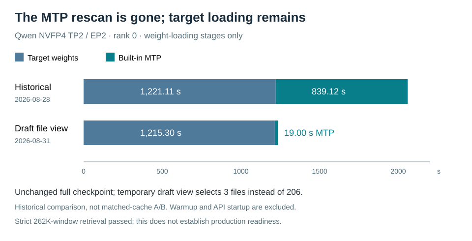
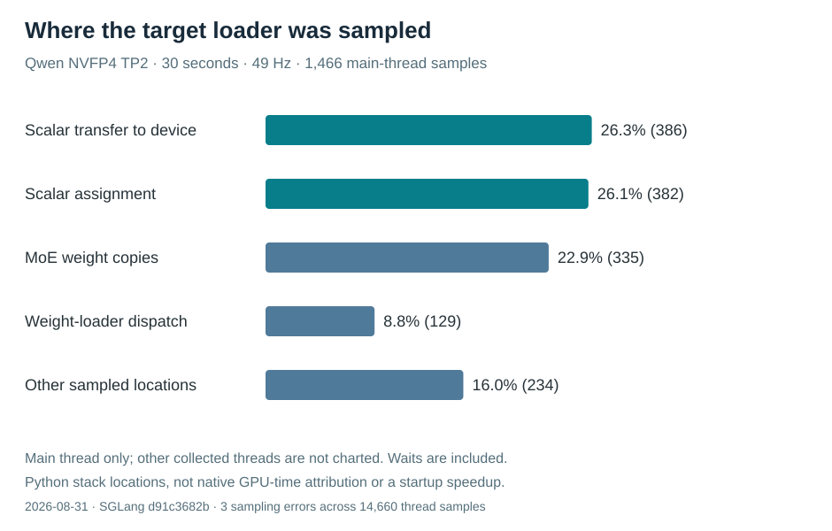

# Qwen built-in MTP: selecting the files before reading them

Status: bounded TP2 GPU inference and strict native-window retrieval passed.
The temporary Pods/view are removed; restoration of the original service is
being verified. This is not a production stability or full model-matrix pass.

Our historical Qwen NVFP4 TP2 native-262K run spent 1,221–1,236 seconds loading
the target and another 839–842 seconds loading its built-in MTP draft, reaching
the API after 2,140.59 seconds. That second scan is worth investigating before
changing the shared filesystem or adding cache-control machinery.

## What the actual pinned runtime does

In SGLang `d91c3682b`, the Qwen4 MTP implementation inherits the Qwen3.5 MTP
loader. It discards non-MTP tensors **after** receiving them from the weight
iterator. The target worker supplies the draft's embedding and output head.
The native `--speculative-draft-model-path` can select a separate directory;
whether this particular reduced view works must still be demonstrated by the
real model. The upstream interface is documented in
[SGLang speculative decoding](https://docs.sglang.io/docs/advanced_features/speculative_decoding).

For `RadixArk/Qwen3.8-Flash-Next-NVFP4` revision
`7b719225242aacd3dbd3f9407468c2ee9a9d2594`:

| Quantity | Measured value |
| --- | ---: |
| Complete checkpoint files | 206 |
| Complete checkpoint bytes | 135,195,303,851 |
| MTP tensors | 31 |
| MTP tensor bytes | 5,214,301,696 |
| Files containing all MTP tensors | 3 |
| Bytes in those three files, including other tensors | 14,734,642,001 |
| Entries in their accurate reduced file index | 1,049 |
| Copied weight bytes / changed source files | 0 / 0 |

The selected files are `model-bf16-00010.safetensors` through
`model-bf16-00012.safetensors`. A symlink to the complete original index would
be wrong: the native file selector verifies that indexed files exist. The
temporary draft directory therefore needs a truthful index of every tensor
in the three selected files. It is an incomplete *draft view*, never the target
model or a smaller substitute for the full checkpoint.

## What has actually passed

All 206 complete shards passed SHA256 against pinned Hub metadata in 223.73
seconds. This measures reading **plus hashing**, with the observed cache state;
it is not a cold raw-filesystem bandwidth benchmark. Header, tensor-index and
file-end checks passed for the temporary view. Original files were read-only.

Both intended GPU nodes imported the same existing assembled runtime, config
ID `sha256:c13c7345095ad010c0b11e68e36707ea9cb109427171e2ebb92d4b7cf5cd50c0`.
The 30,692,449,792-byte archive transferred over an existing direct ConnectX
link in 35.81 seconds; imports took 233.5 and 215.2 seconds. Transfer, unpacking,
hashing and model loading are distinct measurements. Node-cache import is not
GHCR publication. Both temporary archives and the completed reader Job were
removed; the bounded transfer listener expired.

One isolated native-module import stopped because its default compilation-cache
directory was read-only. It did not load a model and does not establish a model
compatibility failure. The GPU trial will use the baseline's writable cache.

## Remaining experiment and restoration boundary

### Real GPU result



| Measurement | Rank 0 | Rank 1 |
| --- | ---: | ---: |
| Full target weight loading | 1,215.30 s | 1,209.90 s |
| Native MTP view loading | 19.00 s | 20.23 s |
| Target memory reported by runtime | 75.62 GB | 76.00 GB |
| MTP load memory delta reported by runtime | 4.44 GB | 4.40 GB |

The target load remained close to the historical run while the MTP scan shrank
from roughly 14 minutes to 20 seconds. Rank-0 container start to the readiness
log was 1,341 seconds (22m21s), including target loading and warmup. This is not
a one-minute startup; target per-tensor loading is still the principal remaining
startup cost. The native full CUDA graphs stayed enabled.

Two exact arithmetic requests passed. Fresh-nonce, forced-length synthetic
completion measured 40.20 tokens/s for one 512-token request and 102.19 tokens/s
aggregate for four simultaneous 512-token requests. This is not an agent or
real-code-review benchmark, and its prompts differ from the historical run.

The strict context test sent **261,888 input tokens plus a 256-token output
budget**, recovered the exact final key from the middle, and stopped normally
after 17 output tokens. It reported zero cache hits, 94.16s TTFT and 2,781.17
prefill tokens/s. It uses the checkpoint's actual chat template with the native
request-level `enable_thinking=false`, not a server output-rewriting patch.

The old long-response probe contained conflicting instructions (only the key
versus a long explanation). Its marker appeared in thinking text, but it did
not prove the final-answer contract. That observation is retained separately,
not counted as the strict pass. The new client also had an initial Python syntax
error before sending any GPU request; the corrected client produced the result.

Both test Pods had zero restarts and zero cgroup OOM/max-limit events. Host boot
IDs remained unchanged. Final host memory available was about 22.3/24.4 GiB.
TileLang emitted a data-race checker warning during JIT; no check was disabled.
These finite tests do not establish that warning is harmless or resolve it.

The available token pool was 308,416 and effective maximum running requests was
nine, versus the historical 374,016/eleven. Identical context length is not an
identical total concurrency capacity, and this difference must remain visible.

[Machine-readable GPU result](../../benchmarks/qwen38-mtp-view-tp2-2026-08-31.json)
records all measurement boundaries and restoration state.

### Reproduce only the draft-view delta

In an isolated GPU test container with the complete checkpoint mounted read-only:

```bash
python3 scripts/prepare-qwen-mtp-view.py /models/full-checkpoint /tmp/mtp-view
# Keep the original complete --model-path and all other tested runtime arguments.
# Add only: --speculative-draft-model-path /tmp/mtp-view
```

The helper copies no weight data and does not patch SGLang. Delete the temporary
directory with the disposable container. Never pass this view as the target
model. The reusable clients are `scripts/benchmark-sglang-decode.py` and
`scripts/strict-context-retrieval.py`; neither creates services or acts as an Agent.

### Target-loading profile from the running GPU trial

The image's existing py-spy captured two 30-second, 49Hz nonblocking samples.
The idle-inclusive capture contains 1,466 main-thread observations; 386 land
at scalar `.to(device)`, 382 at scalar assignment, and 335 at two MoE `copy_`
sites. This is a concrete reason to investigate per-tensor loading work, but
it does not exclude native synchronization, page faults or filesystem waits.
The image does **not** contain fastsafetensors; the separate GLM image's loader
fixes must not be assumed to run here.



[Raw aggregate sample counts](../assets/qwen38-target-load-profile.json) preserve
the measurement boundary. Profiling success is not model-inference success.

### Trial contract and limits

Keep the exact full target, runtime, TP2/EP2 layout, seed, kernels, MTP one-step /
two-draft configuration and 262,144 context. Compare target and draft loading
separately, then run correctness, full-window retrieval and single/concurrent
decode. The historical figures are not a matched-cache A/B control.

The bounded GPU trial used a loopback-only API, ordinary resource-accounted
scheduling, 110GiB Pod memory limits and a one-hour deadline. Those test boundaries
are recorded separately from the sole performance candidate: file selection.
It creates no host daemon, filesystem tuning, cache-drop loop or duplicated
checkpoint. The previous inference service was verified restored at 08:10 UTC:
all four ranks Ready, zero restarts, correct private/public generation HTTP200,
missing/invalid credentials HTTP401, and subsequently converged Flux state.

Machine-readable preflight evidence:
[`benchmarks/qwen38-mtp-view-preflight-2026-08-31.json`](../../benchmarks/qwen38-mtp-view-preflight-2026-08-31.json).
