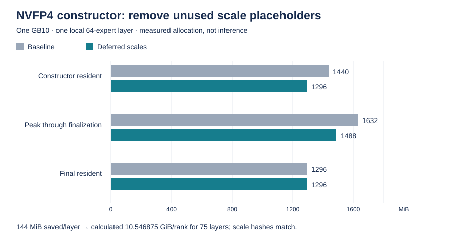

# Loader and memory results

## GLM-5.2 vLLM results

The first default loading path took approximately two hours. Storage was not
the only limit: representative rank-local reads reached 686-839 MiB/s while the
completed loader averaged only about 174 MiB/s per rank. Allocation lifetime
and deserialization work were material parts of the critical path.

The successful bounded change releases the CUDA allocator's unused cached
blocks after a completed safetensors file batch is closed. It is applied by a
hash-guarded build script so a different upstream file fails the build instead
of receiving a blind text patch.

A broader global CUDA-cache disable loaded but reduced decode to approximately
1.88 tokens/s, so it was rejected. Periodic host page-cache dropping was an
earlier experiment and is not retained. No swap manager or OOM daemon was
needed for the successful 8K INT4 result, and none is installed here.

The optimized base load still took 589.25 seconds, not one minute. The data does
not support a one-minute claim. MTP loading took 1,183.05 seconds because its
memory and loading work differed.

## Formal GLM-5.3: constructor A/B, inference still failed

The 2026-08-31 full TP4 prebuilt-image attempt reached NCCL Mesh startup but
exhausted unified memory before completing model loading. It served zero
requests. A bounded one-layer A/B identified 144 MiB of redundant CUTLASS
scale placeholders per local 64-expert layer. Deferring them saves a calculated
10.546875 GiB per rank for the full model's 75 MoE layers. Final scale hashes,
aliases and synthetic packed weights matched; this does not yet prove kernel
outputs or whole-model correctness.

Raw measurements and limits are in
[the constructor record](../benchmarks/glm53-nvfp4-constructor-2026-08-31.json).

The earlier completed-batch patch is in fastsafetensors `ParallelLoader`.
Pinned SGLang f609d677b actually calls `SafeTensorsFileLoader` directly from
`fastsafetensors_weights_iterator`; that call path does **not** execute the
ParallelLoader patch. Its presence in the first GLM-5.3 images is not evidence
that their actual iterator releases allocator cache. Do not transfer the
GLM-5.2 loader result to this different runtime or blame SeaweedFS for a
constructor allocation failure. Direct-iterator buffer lifetime and final
full-model memory headroom remain separate validation items.

The existing four-rank shape audit also bounds what another cache cleanup can
achieve. These are unique registered storages, with aliases counted once:

| Corrected NVFP4 storage, per rank | GiB |
| --- | ---: |
| Packed routed-expert weights (uint8) | 84.375000 |
| Routed-expert block scales (float8) | 10.546875 |
| Attention, shared experts, vocabulary and remaining tensors | 11.110318 |
| Total | 106.032193 |

The first two rows account for89.52% of static storage. They are retained model
tensors, not free allocator cache; another `empty_cache()` cannot remove them.
The scale row is still required after removing the redundant constructor
placeholders. This calculation does not prove there is no further optimization,
but it rules out claiming that the measured106.03GiB is all reclaimable staging.
Loading, communication, KV and inference workspaces require additional room.
In the refreshed admission check, one node had only105.15GiB available to the
scheduler after pausing the original model, because unrelated work was retained.
Lowering the new Pod request would not make the same static model fit that
reservation boundary. No new NVFP4 full-load attempt was started for this audit.

### Alternative NVFP4 checkpoint inspection, 2026-08-31

A fresh read-only Hub metadata/config inspection found the following full
GLM-5.3 artifacts, all declaring78target layers and256routed experts. Sizes
sum safetensors file metadata; they are not measured GPU residency or a full
download/hash verification of these alternatives.

| Publisher | Pinned revision | Shards | Safetensors bytes |
| --- | --- | ---: | ---: |
| [RadixArk](https://huggingface.co/RadixArk/GLM-5.3-NVFP4/tree/363e8f086905afd83db356a620f9aa401c23800a) | 363e8f086905afd83db356a620f9aa401c23800a | 47 | 464,823,042,096 |
| [Inferact](https://huggingface.co/Inferact/GLM-5.3-NVFP4/tree/ce67b36f3669192b5bb233819f0fda6c8a9837f8) | ce67b36f3669192b5bb233819f0fda6c8a9837f8 | 88 | 464,822,832,448 |
| [incoai](https://huggingface.co/incoai/GLM-5.3-NVFP4/tree/54e52520606f96b3d9fc84088ad22882a61648ac) | 54e52520606f96b3d9fc84088ad22882a61648ac | 87 | 464,822,872,912 |
| [underlabs](https://huggingface.co/underlabs/GLM-5.3-NVFP4/tree/88b9cfb6d170d31a84e58333c5658b325b5187c0) | 88b9cfb6d170d31a84e58333c5658b325b5187c0 | 88 | 450,931,568,496 |

The first three do not offer a materially smaller byte layout; inspected
attention projection entries remain excluded from NVFP4. The underlabs card
attributes its smaller size to MTP quantization only, with target weights
unchanged from Inferact. It is therefore not evidence of lower target-model
residency for our current no-MTP baseline. No additional weight copy was
downloaded and no alternative was run. This inspected set does not establish
that no other suitable artifact can exist.

An important naming distinction in the
[community INTmix recipe](https://github.com/tonyd2wild/GLM-5.3-Int4-Int8Mix-TP4-4x-DGX-Spark/tree/a1806cb82493aa6f28709f77acf59c1937bdf756):
its NVFP4-KV/DFlash2 performance lane still uses INT4/INT8 model weights.
Its reported51.03tok/s structured-output result is not an NVFP4-weight result
or our measurement. The recipe also assumes recurring cache drops, swap and
sub-GiB available memory; those host changes are not imported into our test.
For future A/B, separate weight format, KV format, drafter and workload before
comparing numbers. Full NVFP4-weight inference remains unpassed here.

### Native two-stage capacity attempt

Before the mixed-precision test, a separate native NVFP4 TP2/EP2/PP2
capacity attempt retained all 78 layers in a 42/36 partition. It failed
before construction in the PP communicator's warm-up all-reduce. All four
schedulers logged an NCCL exception even though their containers exited 0;
there were zero shape reports, loaded checkpoints or inference requests.
Kubernetes `Completed` therefore did not make this experiment pass.

The attempt reused physical cycle order 0/1/2/3. Its TP pairs (0,1) and
(2,3) are direct neighbors, but its PP pairs (0,2) and (1,3) are not. The
observed TP connection followed by PP failure is consistent with this rank
mapping error. A proposed 0/1/3/2 logical order maps both kinds of pair to
existing direct links, without changing any cable, route or host setting.
That correction was subsequently tested below. It cannot stand in for the
unresolved optimized TP4 cell.
The diagnostic was removed and the original four-rank service was verified
Ready with zero restarts and an authenticated correct response at 12:01 UTC.

At12:12UTC the corrected0/1/3/2 mapping completed native NCCL initialization
and produced all four constructor reports. No cable, route or host setting
changed. The42/36 allocation measured109.269445GiB of static tensor storage
per first-stage rank and99.863876GiB per second-stage rank. The head reported
110.50GiB available before construction, leaving only1.23GiB for everything
outside these tensors. That does not establish enough loader/KV/runtime margin.
Actual Torch allocation was about71.38MiB/rank because this was a FakeTensor
audit; all78layers were represented, but no weights or requests were loaded.
The diagnostic Job was removed. At12:21UTC the original four-rank service
was Ready with zero restarts, fresh node Leases and correct authenticated
generation. This is passed-restored for the bounded constructor diagnostic,
not a passing real-model capacity, loading or inference result.

There is a further loader boundary: the
[pinned SGLang iterator](https://github.com/sgl-project/sglang/blob/f609d677b/python/sglang/srt/model_loader/weight_utils.py)
uses the global WORLD group, not the tensor-parallel subgroup. In the inspected
fastsafetensors0.3.3 source, get_tensor performs a group broadcast. The new
logical grid therefore still needs a loader-group validation, even though
native TP/PP initialization passed. The iterator also lacks an explicit
FilesBufferOnDevice close; possible retained buffers must be measured, not
assumed fixed by a patch to the unused ParallelLoader path. No new loader
patch, real-weight trial or inference performance is claimed for this run.

## Formal GLM-5.3 INT4/INT8: file staging is separate from model size

The fixed `Tech2wild/GLM-5.3-Int4-Int8Mix` revision
`206507bbb047d8223964a0414cd83230c59428f9` has282 safetensors files totaling
405,241,870,672bytes. Its immutable index SHA256 is
`c935795467984516f24a64d2dc2ce07bed74a8f83ada76950f28b847786eeddf`.
Read-only index/header inspection identified three pure-MTP files271–273,
totaling8,045,089,968bytes. Files270 and274 contain both MTP and target tensors;
later files contain target layers8/9. Dropping the final twelve files would
drop target weights, not merely MTP. A279-file target view is only a candidate,
not a measured optimization or an altered checkpoint.

In the pinned vLLM package, fastsafetensors0.3.2 actually calls ParallelLoader.
Its native queue0 overlaps two source-file batches; each rank stages one file
per batch. The largest first file is4.648GiB and contains two BF16 vocabulary
tensors, each1.772GiB. The native iterator broadcasts complete tensors before
the model weight loader slices them for tensor parallelism. Cache-disabled
broadcasts do not accumulate all tensors, but their live allocation and
postload Marlin repacking still require headroom beyond static model storage.

Calculated maximum source-file staging by TP rank, full282-file sorted list:

| Rank | One file, GiB | Two consecutive assigned files, GiB |
| --- | ---: | ---: |
| 0 | 4.648 | 6.044 |
| 1 | 2.127 | 3.616 |
| 2 | 2.498 | 3.883 |
| 3 | 2.498 | 3.785 |

These are byte-layout calculations, **not measured allocation peaks**. They
exclude broadcast tensors, final weights, per-layer repacking, communication,
KV and runtime. The94.65GiB/rank constructor result therefore does not prove
a safe full load. Native serial queue=-1 and an exact pure-MTP file view are
possible bounded candidates; neither has yet passed a full-model startup or
performance comparison. No host cache dropping or persistent tuning is added.
Formal NVFP4 remains separately unresolved and has zero successful requests.

The pinned loader applies `ignore_patterns` when downloading, not when globbing
an existing local model directory. That CLI flag alone would not implement the
proposed selection on a mounted snapshot. Preserve the complete snapshot for
verification; a future selection must use an explicit disposable file view,
not remove checkpoint files. No selection was applied during this inspection.

## Pinned-host cache: measured separately from CUDA cache

A bounded2026-08-31 GPU microprobe used the existing Torch2.11.0/cu130,
fastsafetensors0.3.2 image, two synthetic tmpfs files and no model checkpoint.
Its default GB10 unified copier uses `from_file(...).pin_memory()` before the
device copy. Dropping its Python references and calling `torch.cuda.empty_cache()`
does not flush the separate host caching allocator.

| Copy path | Sample | Pinned bytes owned after close + device flush | After host flush | Tensor equality |
| --- | ---: | ---: | ---: | --- |
| Unified default | 32MiB | 33,554,433 | 0 | passed |
| Unified default | 65MiB | 134,217,729 | 0 | passed |
| Native no-GDS | 32MiB | 1 | 0 | passed |
| Native no-GDS | 65MiB | 1 | 0 | passed |

The one-byte allocation accompanies scalar checks. The65MiB unified sample
illustrates power-of-two pinned allocation rounding to128MiB. The native
process-local `FASTSAFETENSORS_UNIFIED_MEM=0` selector avoided that whole-file
pinned cache in the same small fixture. It still has its native bounce buffer
and a whole-file device allocation; it is not a zero-memory loading path.

Torch2.11 provides the private `torch._C._host_emptyCache()` used here. This is
not a host page-cache drop or another process's allocator flush. Its statistics
showed owned bytes falling to zero, but system MemAvailable did not immediately
rise; `active_bytes.current` was also inconsistent with owned bytes. We do not
infer equivalent physical-memory recovery or a confirmed leak from those
counters. See the [PyTorch explanation](https://docs.pytorch.org/devlogs/eager/2026-08-09-pinned-memory-allocator/).

The [exact probe](../benchmarks/profile_fastsafetensors_host_cache.py) and
[results/bounds](../benchmarks/fastsafetensors-host-cache-2026-08-31.json)
preserve both paths. Run only in a disposable Linux GPU process with the recorded
resource limits, first with the selector unset and then set to0; the executed
second run set the same variable inside the process before CUDA initialization.
Do not run this as a daemon or infer model performance from one tmpfs sample.
Both diagnostic containers/tmpfs were removed; the original four-rank service
remained Ready with zero restarts and passed an authenticated arithmetic request.
The initial `python` entrypoint failed before execution; this image uses `python3`.
No copier setting, host-cache flush, new image or host configuration was retained.

Upstream [PR81](https://github.com/foundation-model-stack/fastsafetensors/pull/81)
is included in0.3.3 and reduces selected expert I/O, but explicitly retains
full-file device allocation. [Issue71](https://github.com/foundation-model-stack/fastsafetensors/issues/71)
and the separate [retention report94](https://github.com/foundation-model-stack/fastsafetensors/issues/94)
were still open when checked. Neither an upgrade nor this microprobe proves
a safe full GLM load. A real-checkpoint copier A/B remains necessary before
retaining a performance choice; formal GLM-5.3 still has zero successful requests.

## Checkpoint download transport is not GPU loader throughput

During2026-08-31 formal INT4/INT8 preparation, a native SeaweedFS4.44 FUSE
mount on a non-GPU control node uploaded the fixed405GB snapshot through
ordinary Kubernetes addresses. One attempt failed with Filer connection
cancellation followed by write/flushEIO. Same-directory resume preserved
partial bytes and progressed; full checksums were still pending. This was
not a model OOM or a successful inference run.

Read-only sampling under that live upload isolated internal TCP peers:

| Measured boundary | Observation |
| --- | --- |
| Volume TCP connections | 165 established across four servers |
| Median TCP RTT by volume server | 1,071 / 352 / 349 / 342 ms |
| Matched sockets over 10.064 seconds | 433,952,785 bytes sent; 10,979,850 retransmitted |
| Filer gRPC | Three sockets; median RTT 329.525 ms |
| Direct Tailscale campus peers | Ping 343–352 ms; no DERP path observed |
| Ordinary campus IP ping | Two peers averaged 0.412 / 0.217 ms, three replies each |
| Following 10.002-second tunnel sample | 493,709,320 TX bytes; 8,576 additional TX drops |

These observations show substantial overlay-path delay/loss under bulk upload,
not intrinsically slow FUSE or NVMe. The ping probes differ and were sampled
sequentially, not as a controlled throughput A/B. Counters do not identify the
exact internal drop site or sole cause of the earlier gRPC cancellation.
The downloader's2Gi cgroup recorded limit hits but no OOM/kill and2.285seconds
cumulative memory pressure; we do not infer a memory cause from working set.

No host network, tunnel, CSI, offload, queue or memory policy was changed.
The progressing downloader was not restarted. Spark-side bulk model loading
uses the separate ConnectX volume-server path, so these download observations
cannot replace a full-checkpoint loader profile or inference benchmark.

### Full-checksum read phase

The same attempt finished downloading at 11:18:32 UTC and began native HF cache
verification. A 30.002-second sample at 11:32:53–11:33:23 UTC measured 1,721,778,544
additional process-read bytes: 57.39 MB/s (54.73 MiB/s). The open checkpoint file
advanced from 33 to 34 of 282. Process read counters are not a count of bytes
already accepted by the checksum verifier, and verification had not passed.

The verifier consumed 3.47 CPU-seconds, while the whole downloader/mount cgroup
consumed 24.139 CPU-seconds (about 0.80 core) against its 2-CPU limit. There were no
additional CPU-throttled periods. A following kernel stack sample waited in
`folio_wait_bit_common` via `filemap_read` and `fuse_file_read_iter`. This
supports a read-wait bottleneck in that window, not a CPU-limit bottleneck;
it does not identify FUSE itself as the sole cause. The 2 GiB memory cgroup had
696 additional limit hits, 0.141 seconds of memory pressure and zero OOM/kills.
These observations do not justify increasing limits or changing host policy.

No verifier was restarted or duplicated, and the original four-rank model
service remained Ready with zero restarts. These control-node checksum reads
use the ordinary network path, not the Spark ConnectX model-loading path;
their speed is not inference or GPU-loader performance. Full verification
remains required before publishing the checkpoint and starting the real test.
