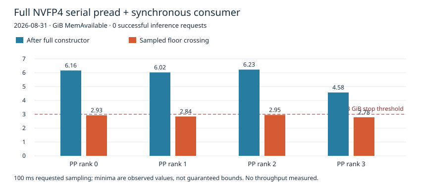
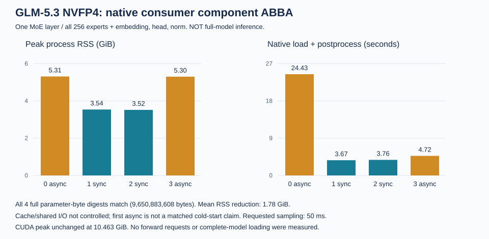
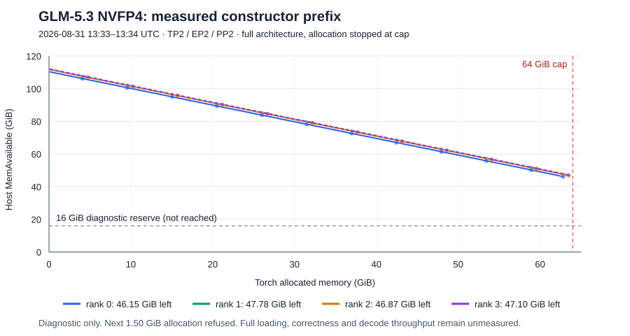
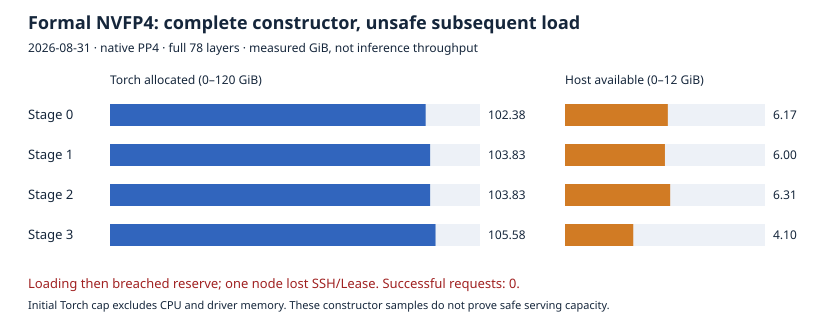
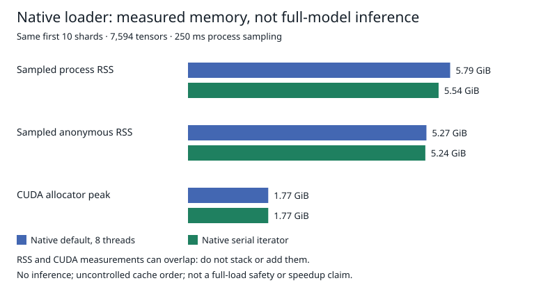
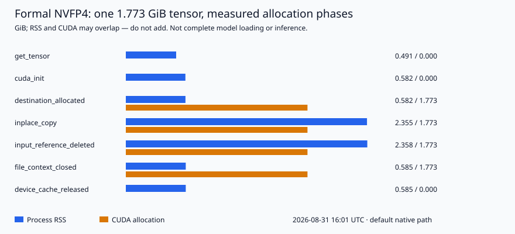
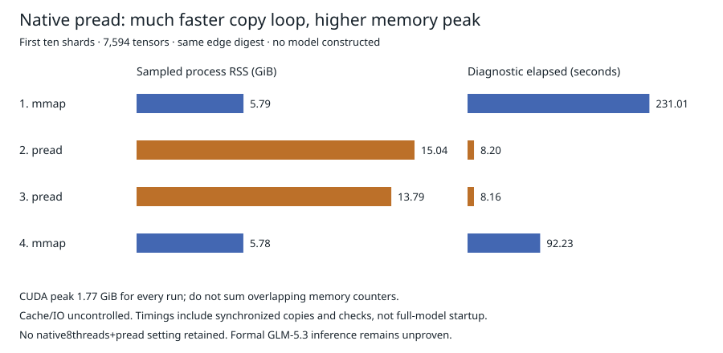
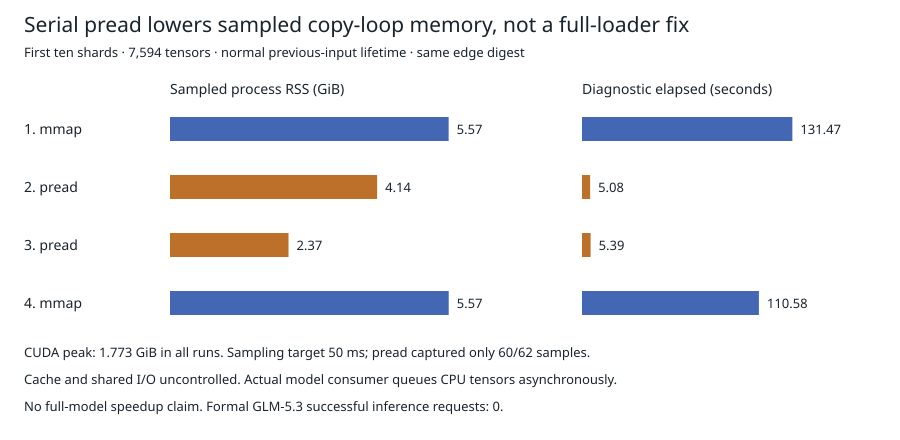
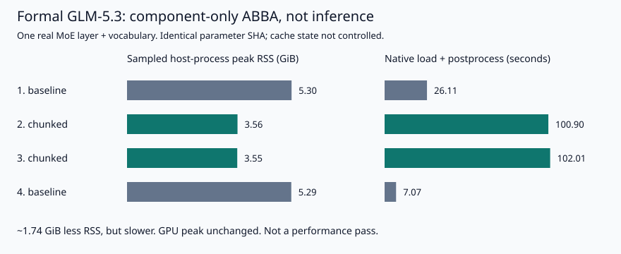

# Loader and memory results

### Full native serial-pread/synchronous load (19:12 UTC)

The candidate was assembled into a fixed image and **actually run with the full
formal GLM-5.3 NVFP4 checkpoint on four GPUs**. It did not finish loading or
produce any inference request. All78layers/256experts remained present, using
native TP1/EP1/PP4 partitions21/19/19/19 and `flashinfer_cutlass`; no eager mode,
extra quantization, cropped-model fixture or foreign-workspace eviction.

| PP rank | Constructor Torch GiB | Host available after constructor GiB | Sampled minimum GiB | Parent elapsed to exit s | Driver allocation warning lines |
| --- | ---: | ---: | ---: | ---: | ---: |
| 0 | 102.379 | 6.163 | 2.928 | 50.55 | 26 |
| 1 | 103.827 | 6.023 | 2.843 | 41.84 | 40 |
| 2 | 103.827 | 6.227 | 2.954 | 46.04 | 78 |
| 3 | 105.582 | 4.575 | 2.784 | 47.57 | 80 |

The full native constructors returned in5.97-7.54seconds. During initial
weight reads every rank crossed the unchanged3GiB MemAvailable floor and
its tested parent terminated only its own process group with SIGTERM.
Each child exited-15 and parent75. NVIDIA `NV_ERR_NO_MEMORY` lines occurred
19:12:47-51UTC; no Linux OOM kill, Xid, reboot or new systemd core was observed
during the test. Warning-line counts are not distinct failed allocations.
Requested100ms sampling stops after a crossing and cannot guarantee that3GiB
remains reserved. Orderly cleanup is not a passing memory-safety result.

The previous1.777GiB component RSS saving was real but insufficient for full
loading. Non-final ranks logged `lm_head.weight not found in params_dict`
after reading an output tensor they do not own. Moving ownership filtering
before CPU tensor materialization is a concrete next hypothesis, **not yet a
validated fix**; the final rank still needs its output tensor. Do not attribute
all memory pressure to this one tensor or rerun this unchanged recipe.

The389120byte OCI delta reused82verified existing base blobs; four imports
took0.48-0.53seconds. This is incremental reuse of an existing large image,
not a complete installation benchmark or a published working serving image.
[Exact sanitized measurements](assets/glm53-native-full-sync.json) include
image hashes, sampling, unchanged bounds and all four constructor/stop events.
The build container, four test containers and exact candidate image tags were
removed. Original-service four ranks were Ready/zero restarts19:20:49UTC.
Backend health200 and missing/invalid401/authenticated correct200 passed
19:21:37UTC; an independent external client passed401/401/200 at19:22:06-07UTC.
All hosts retained their boots, SSH/services/GPUs and fresh Leases; four storage
owners registered. Restore startup logged47/16/34/73driver warning lines in
physical-node order, no Linux OOM/Xid. Post-Ready matching counts remained0
through19:22:09UTC. No new core files. This is bounded recovery, not long-term
stability. Candidate outcome: **failed-restored**.
**Full GLM-5.3 NVFP4 inference remains0; throughput is not measured.**

### Full-runtime integration preflight (18:38-18:50 UTC)

At this earlier checkpoint the candidate was still unintegrated
and had not passed full-model GPU inference. A bounded non-GPU source preflight
checked two proposed shortcuts against the actual cached runtime:

- Native `LayeredModelLoader` requires `load_weights_to_module`; the installed
  DeepSeek implementation (`c78b4ad7`), native consumer (`51ea4fe5`) and cached
  GLM subclass variants have no such method. It is not a drop-in loader choice.
- The actual patched NVFP4 implementation (`c6abd52b`) already uses the native
  source/derived scale alias helper (`5d3b3d71`). Compatible scales reuse source
  storage, consistent with the earlier GPU alias test. Removing a second
  attribute does not establish any additional storage saving.

No full model, new image or runtime modification was made. The temporary CPU
container was deleted and independently confirmed absent; the original service
stayed Ready. Full constructor, CPU staging, non-Torch driver allocations,
native postprocessing and KV memory must still be tested together. The existing
component RSS saving is not a complete-model capacity guarantee, and the old
deferred-scale saving must not be counted twice. Formal GLM-5.3 NVFP4 remains
at **zero successful full-model inference requests**.

### Native consumer and quantization post-load ABBA (17:36-17:38 UTC)

This one-GPU test goes beyond tensor copies: it constructs real layer3 with
all256experts, embedding/head/norm, then runs native weight mapping, QKV/expert
loading and quantization postprocessing. Other layers are missing-layer
placeholders solely to bound the diagnostic. **No forward request is run; this
is not a cropped model presented as a successful full GLM-5.3 deployment.**

Same verified653d982 checkpoint,3089tensors in7shards, serialpread input;
only the native consumer async predicate changes across async/sync/sync/async.
Every run ends with32registered parameters/9,650,883,608bytes and the identical
full-byte SHA256 `d9f706e49f8e58529b9a6ad5bcb06f5a09463b28bd86643823371da92c103f47`.
This includes native post-load transforms but does not validate forward outputs.

| Run | Native consumer | Peak RSS GiB | Peak anonymous GiB | Load + postprocess s | Pending task peak |
| --- | --- | ---: | ---: | ---: | ---: |
| 0 | async | 5.307 | 4.721 | 24.432 | 19 |
| 1 | sync | 3.535 | 2.949 | 3.670 | 0 |
| 2 | sync | 3.515 | 2.929 | 3.759 | 0 |
| 3 | async | 5.297 | 4.711 | 4.723 | 29 |

The synchronous path lowers mean measured RSS by1.777GiB (about33.5%). Native
async submitted3088tasks and peaked at3.55-3.58GiB of outstanding logical input
bytes; those counts can overlap and are **not** physical resident memory.
Sync submitted no tasks. The observer captures only byte counts in completion
callbacks; it does not retain input tensors or change async queue behavior.
The last async run took4.72s against3.67/3.76s for sync; the first async24.43s
also includes uncontrolled cache/shared-I/O effects. Do not claim a6x full-model
speedup, one-minute cold start, or causally attribute every RSS byte to queuing.

Torch peak remained10.463GiB in every run; minimum host availability96.67GiB.
Requested50ms sampling produced284/134/135/155samples; peaks may be missed.
One32GiPod,20GiTorch cap,64Gi host floor,1800s total/420s per child.
No eager mode, host tuning, cache-drop, extra quantization or checkpoint rewrite.
Each child deliberately raises an end-of-component sentinel; SGLang logs its
SIGQUIT/kill_process_tree cleanup and exits-9. Parent requires the explicit
result/hash agreement, restores its container source and exits0. No Linux OOM,
Xid or driver allocation error appeared on any of the four hosts during the
component interval through17:39:43Z. No inference request was issued.

The initial attempt stopped before allocation because expected upstream and
installed hashes differed. We inspected the exact stopped-container snapshot
without mounting/mutating it and reviewed differences on a non-GPU development
node before retrying. Actual loader89cab28a and deepseek_v2 c78b4ad7 include
runtime-context compatibility and EXPERT_PACK-related branches; this test uses
modelopt_fp4 and unchanged native consumer51ea4fe5. The cached image is not
claimed to be a byte-identical f609 source checkout. Exact hashes are in
[the sanitized data](assets/glm53-native-consumer.json).

The exact executed [wrapper](../tests/glm53_native_consumer_wrapper.py) and
[parent](../tests/glm53_native_consumer_parent.py) are diagnostic artifacts,
not serving profiles. Run the parent only inside the pinned disposable GPU
container with the same read-only checkpoint mount and recorded resource bounds;
never apply the one-layer wrapper to a production service. The test container
was removed at17:39:38Z, and Git restored the original service desired state.
The original four-rank service became Ready at17:44:40Z with zero restarts.
Actual backend17:44:52Z and independent public17:45:55-57Z authentication and
correct generation passed (401/401/200). All nodes/leases, host SSH/services/GPU,
four storage owners and disks passed; no newcores. Probe errors were0.
Original-service startup logged91/44/35/73 driver warnings, no LinuxOOM/Xid;
afterReady through17:46:14Z matching errors were0. This is a short restoration
check, not evidence of a warning-free startup or long-term stability.
Component outcome: **passed-restored**; complete-model inference remains0.

Next: incorporate only the validated serial input/consumer behavior into the
full native loader, retaining PP ownership and all78layers/256experts; include
constructor, CPU/driver, post-load and KV peaks in admission. A1.78GiB component
RSS saving alone does not establish safe full-model capacity. Formal GLM-5.3
NVFP4 still has **zero successful inference requests**.

### Native integration caveat (18:03 UTC; source checks only)

The pinned runtime's `--weight-loader-disable-mmap` is **not** equivalent to
the tested per-tensor pread reader: its serial branch uses
`safetensors.torch.load(f.read())`, reading a complete shard before yielding
tensors. Do not substitute that flag for the measured reader.

A two-line native-source candidate now selects `backend="pread"` in the serial
iterator and synchronous loading in `DeepseekV2WeightLoaderMixin.do_load_weights`.
The remaining source bytes, including PP ownership, all layers/experts and
post-load transforms, are unchanged. Exact-source hashes, syntax and a stubbed
lazy-iterator check passed in the existing non-GPU development container.
Its git/patch tools were absent; no package was installed and no git-apply
check is claimed. The patch and source-test program remain private experiment
artifacts until actual runtime validation; this is not a published working
serving image, integrated GPU test, or full-model pass. DeepSeek was not paused.

The preceding component's parameter digest covers named parameters only, not
every CUDA buffer or unregistered tensor attribute. Its 1.777 GiB RSS saving
does not yet establish complete-model constructor/post-load/KV capacity.

## GLM-5.2 vLLM results

The first default loading path took approximately two hours. Storage was not
the only limit: representative rank-local reads reached 686-839 MiB/s while the
completed loader averaged only about 174 MiB/s per rank. Allocation lifetime
and deserialization work were material parts of the critical path.

The successful bounded change releases the CUDA allocator's unused cached
blocks after a completed safetensors file batch is closed. It is applied by a
hash-guarded build script so a different upstream file fails the build instead
of receiving a blind text patch.

A broader global CUDA-cache disable loaded but reduced decode to approximately
1.88 tokens/s, so it was rejected. Periodic host page-cache dropping was an
earlier experiment and is not retained. No swap manager or OOM daemon was
needed for the successful 8K INT4 result, and none is installed here.

The optimized base load still took 589.25 seconds, not one minute. The data does
not support a one-minute claim. MTP loading took 1,183.05 seconds because its
memory and loading work differed.

## Formal GLM-5.3: constructor A/B, inference still failed

The 2026-08-31 full TP4 prebuilt-image attempt reached NCCL Mesh startup but
exhausted unified memory before completing model loading. It served zero
requests. A bounded one-layer A/B identified 144 MiB of redundant CUTLASS
scale placeholders per local 64-expert layer. Deferring them saves a calculated
10.546875 GiB per rank for the full model's 75 MoE layers. Final scale hashes,
aliases and synthetic packed weights matched; this does not yet prove kernel
outputs or whole-model correctness.

Raw measurements and limits are in
[the constructor record](../benchmarks/glm53-nvfp4-constructor-2026-08-31.json).

The earlier completed-batch patch is in fastsafetensors `ParallelLoader`.
Pinned SGLang f609d677b actually calls `SafeTensorsFileLoader` directly from
`fastsafetensors_weights_iterator`; that call path does **not** execute the
ParallelLoader patch. Its presence in the first GLM-5.3 images is not evidence
that their actual iterator releases allocator cache. Do not transfer the
GLM-5.2 loader result to this different runtime or blame SeaweedFS for a
constructor allocation failure. Direct-iterator buffer lifetime and final
full-model memory headroom remain separate validation items.

The existing four-rank shape audit also bounds what another cache cleanup can
achieve. These are unique registered storages, with aliases counted once:

| Corrected NVFP4 storage, per rank | GiB |
| --- | ---: |
| Packed routed-expert weights (uint8) | 84.375000 |
| Routed-expert block scales (float8) | 10.546875 |
| Attention, shared experts, vocabulary and remaining tensors | 11.110318 |
| Total | 106.032193 |

The first two rows account for89.52% of static storage. They are retained model
tensors, not free allocator cache; another `empty_cache()` cannot remove them.
The scale row is still required after removing the redundant constructor
placeholders. This calculation does not prove there is no further optimization,
but it rules out claiming that the measured106.03GiB is all reclaimable staging.
Loading, communication, KV and inference workspaces require additional room.
In the refreshed admission check, one node had only105.15GiB available to the
scheduler after pausing the original model, because unrelated work was retained.
Lowering the new Pod request would not make the same static model fit that
reservation boundary. No new NVFP4 full-load attempt was started for this audit.

### Alternative NVFP4 checkpoint inspection, 2026-08-31

A fresh read-only Hub metadata/config inspection found the following full
GLM-5.3 artifacts, all declaring78target layers and256routed experts. Sizes
sum safetensors file metadata; they are not measured GPU residency or a full
download/hash verification of these alternatives.

| Publisher | Pinned revision | Shards | Safetensors bytes |
| --- | --- | ---: | ---: |
| [RadixArk](https://huggingface.co/RadixArk/GLM-5.3-NVFP4/tree/363e8f086905afd83db356a620f9aa401c23800a) | 363e8f086905afd83db356a620f9aa401c23800a | 47 | 464,823,042,096 |
| [Inferact](https://huggingface.co/Inferact/GLM-5.3-NVFP4/tree/ce67b36f3669192b5bb233819f0fda6c8a9837f8) | ce67b36f3669192b5bb233819f0fda6c8a9837f8 | 88 | 464,822,832,448 |
| [incoai](https://huggingface.co/incoai/GLM-5.3-NVFP4/tree/54e52520606f96b3d9fc84088ad22882a61648ac) | 54e52520606f96b3d9fc84088ad22882a61648ac | 87 | 464,822,872,912 |
| [underlabs](https://huggingface.co/underlabs/GLM-5.3-NVFP4/tree/88b9cfb6d170d31a84e58333c5658b325b5187c0) | 88b9cfb6d170d31a84e58333c5658b325b5187c0 | 88 | 450,931,568,496 |

The first three do not offer a materially smaller byte layout; inspected
attention projection entries remain excluded from NVFP4. The underlabs card
attributes its smaller size to MTP quantization only, with target weights
unchanged from Inferact. It is therefore not evidence of lower target-model
residency for our current no-MTP baseline. No additional weight copy was
downloaded and no alternative was run. This inspected set does not establish
that no other suitable artifact can exist.

An important naming distinction in the
[community INTmix recipe](https://github.com/tonyd2wild/GLM-5.3-Int4-Int8Mix-TP4-4x-DGX-Spark/tree/a1806cb82493aa6f28709f77acf59c1937bdf756):
its NVFP4-KV/DFlash2 performance lane still uses INT4/INT8 model weights.
Its reported51.03tok/s structured-output result is not an NVFP4-weight result
or our measurement. The recipe also assumes recurring cache drops, swap and
sub-GiB available memory; those host changes are not imported into our test.
For future A/B, separate weight format, KV format, drafter and workload before
comparing numbers. Full NVFP4-weight inference remains unpassed here.

### Native two-stage capacity attempt

Before the mixed-precision test, a separate native NVFP4 TP2/EP2/PP2
capacity attempt retained all 78 layers in a 42/36 partition. It failed
before construction in the PP communicator's warm-up all-reduce. All four
schedulers logged an NCCL exception even though their containers exited 0;
there were zero shape reports, loaded checkpoints or inference requests.
Kubernetes `Completed` therefore did not make this experiment pass.

The attempt reused physical cycle order 0/1/2/3. Its TP pairs (0,1) and
(2,3) are direct neighbors, but its PP pairs (0,2) and (1,3) are not. The
observed TP connection followed by PP failure is consistent with this rank
mapping error. A proposed 0/1/3/2 logical order maps both kinds of pair to
existing direct links, without changing any cable, route or host setting.
That correction was subsequently tested below. It cannot stand in for the
unresolved optimized TP4 cell.
The diagnostic was removed and the original four-rank service was verified
Ready with zero restarts and an authenticated correct response at 12:01 UTC.

At12:12UTC the corrected0/1/3/2 mapping completed native NCCL initialization
and produced all four constructor reports. No cable, route or host setting
changed. The42/36 allocation measured109.269445GiB of static tensor storage
per first-stage rank and99.863876GiB per second-stage rank. The head reported
110.50GiB available before construction, leaving only1.23GiB for everything
outside these tensors. That does not establish enough loader/KV/runtime margin.
Actual Torch allocation was about71.38MiB/rank because this was a FakeTensor
audit; all78layers were represented, but no weights or requests were loaded.
The diagnostic Job was removed. At12:21UTC the original four-rank service
was Ready with zero restarts, fresh node Leases and correct authenticated
generation. This is passed-restored for the bounded constructor diagnostic,
not a passing real-model capacity, loading or inference result.

There is a further loader boundary: the
[pinned SGLang iterator](https://github.com/sgl-project/sglang/blob/f609d677b/python/sglang/srt/model_loader/weight_utils.py)
uses the global WORLD group, not the tensor-parallel subgroup. In the inspected
fastsafetensors0.3.3 source, get_tensor performs a group broadcast. The new
logical grid therefore still needs a loader-group validation, even though
native TP/PP initialization passed. The iterator also lacks an explicit
FilesBufferOnDevice close; possible retained buffers must be measured, not
assumed fixed by a patch to the unused ParallelLoader path. No new loader
patch, real-weight trial or inference performance is claimed for this run.

## Formal GLM-5.3 INT4/INT8: file staging is separate from model size

The fixed `Tech2wild/GLM-5.3-Int4-Int8Mix` revision
`206507bbb047d8223964a0414cd83230c59428f9` has282 safetensors files totaling
405,241,870,672bytes. Its immutable index SHA256 is
`c935795467984516f24a64d2dc2ce07bed74a8f83ada76950f28b847786eeddf`.
Read-only index/header inspection identified three pure-MTP files271–273,
totaling8,045,089,968bytes. Files270 and274 contain both MTP and target tensors;
later files contain target layers8/9. Dropping the final twelve files would
drop target weights, not merely MTP. A279-file target view is only a candidate,
not a measured optimization or an altered checkpoint.

In the pinned vLLM package, fastsafetensors0.3.2 actually calls ParallelLoader.
Its native queue0 overlaps two source-file batches; each rank stages one file
per batch. The largest first file is4.648GiB and contains two BF16 vocabulary
tensors, each1.772GiB. The native iterator broadcasts complete tensors before
the model weight loader slices them for tensor parallelism. Cache-disabled
broadcasts do not accumulate all tensors, but their live allocation and
postload Marlin repacking still require headroom beyond static model storage.

Calculated maximum source-file staging by TP rank, full282-file sorted list:

| Rank | One file, GiB | Two consecutive assigned files, GiB |
| --- | ---: | ---: |
| 0 | 4.648 | 6.044 |
| 1 | 2.127 | 3.616 |
| 2 | 2.498 | 3.883 |
| 3 | 2.498 | 3.785 |

These are byte-layout calculations, **not measured allocation peaks**. They
exclude broadcast tensors, final weights, per-layer repacking, communication,
KV and runtime. The94.65GiB/rank constructor result therefore does not prove
a safe full load. Native serial queue=-1 and an exact pure-MTP file view are
possible bounded candidates; neither has yet passed a full-model startup or
performance comparison. No host cache dropping or persistent tuning is added.
Formal NVFP4 remains separately unresolved and has zero successful requests.

The pinned loader applies `ignore_patterns` when downloading, not when globbing
an existing local model directory. That CLI flag alone would not implement the
proposed selection on a mounted snapshot. Preserve the complete snapshot for
verification; a future selection must use an explicit disposable file view,
not remove checkpoint files. No selection was applied during this inspection.

## Pinned-host cache: measured separately from CUDA cache

A bounded2026-08-31 GPU microprobe used the existing Torch2.11.0/cu130,
fastsafetensors0.3.2 image, two synthetic tmpfs files and no model checkpoint.
Its default GB10 unified copier uses `from_file(...).pin_memory()` before the
device copy. Dropping its Python references and calling `torch.cuda.empty_cache()`
does not flush the separate host caching allocator.

| Copy path | Sample | Pinned bytes owned after close + device flush | After host flush | Tensor equality |
| --- | ---: | ---: | ---: | --- |
| Unified default | 32MiB | 33,554,433 | 0 | passed |
| Unified default | 65MiB | 134,217,729 | 0 | passed |
| Native no-GDS | 32MiB | 1 | 0 | passed |
| Native no-GDS | 65MiB | 1 | 0 | passed |

The one-byte allocation accompanies scalar checks. The65MiB unified sample
illustrates power-of-two pinned allocation rounding to128MiB. The native
process-local `FASTSAFETENSORS_UNIFIED_MEM=0` selector avoided that whole-file
pinned cache in the same small fixture. It still has its native bounce buffer
and a whole-file device allocation; it is not a zero-memory loading path.

Torch2.11 provides the private `torch._C._host_emptyCache()` used here. This is
not a host page-cache drop or another process's allocator flush. Its statistics
showed owned bytes falling to zero, but system MemAvailable did not immediately
rise; `active_bytes.current` was also inconsistent with owned bytes. We do not
infer equivalent physical-memory recovery or a confirmed leak from those
counters. See the [PyTorch explanation](https://docs.pytorch.org/devlogs/eager/2026-08-09-pinned-memory-allocator/).

The [exact probe](../benchmarks/profile_fastsafetensors_host_cache.py) and
[results/bounds](../benchmarks/fastsafetensors-host-cache-2026-08-31.json)
preserve both paths. Run only in a disposable Linux GPU process with the recorded
resource limits, first with the selector unset and then set to0; the executed
second run set the same variable inside the process before CUDA initialization.
Do not run this as a daemon or infer model performance from one tmpfs sample.
Both diagnostic containers/tmpfs were removed; the original four-rank service
remained Ready with zero restarts and passed an authenticated arithmetic request.
The initial `python` entrypoint failed before execution; this image uses `python3`.
No copier setting, host-cache flush, new image or host configuration was retained.

Upstream [PR81](https://github.com/foundation-model-stack/fastsafetensors/pull/81)
is included in0.3.3 and reduces selected expert I/O, but explicitly retains
full-file device allocation. [Issue71](https://github.com/foundation-model-stack/fastsafetensors/issues/71)
and the separate [retention report94](https://github.com/foundation-model-stack/fastsafetensors/issues/94)
were still open when checked. Neither an upgrade nor this microprobe proves
a safe full GLM load. A real-checkpoint copier A/B remains necessary before
retaining a performance choice; formal GLM-5.3 still has zero successful requests.

## Checkpoint download transport is not GPU loader throughput

During2026-08-31 formal INT4/INT8 preparation, a native SeaweedFS4.44 FUSE
mount on a non-GPU control node uploaded the fixed405GB snapshot through
ordinary Kubernetes addresses. One attempt failed with Filer connection
cancellation followed by write/flushEIO. Same-directory resume preserved
partial bytes and progressed; full checksums were still pending. This was
not a model OOM or a successful inference run.

Read-only sampling under that live upload isolated internal TCP peers:

| Measured boundary | Observation |
| --- | --- |
| Volume TCP connections | 165 established across four servers |
| Median TCP RTT by volume server | 1,071 / 352 / 349 / 342 ms |
| Matched sockets over 10.064 seconds | 433,952,785 bytes sent; 10,979,850 retransmitted |
| Filer gRPC | Three sockets; median RTT 329.525 ms |
| Direct Tailscale campus peers | Ping 343–352 ms; no DERP path observed |
| Ordinary campus IP ping | Two peers averaged 0.412 / 0.217 ms, three replies each |
| Following 10.002-second tunnel sample | 493,709,320 TX bytes; 8,576 additional TX drops |

These observations show substantial overlay-path delay/loss under bulk upload,
not intrinsically slow FUSE or NVMe. The ping probes differ and were sampled
sequentially, not as a controlled throughput A/B. Counters do not identify the
exact internal drop site or sole cause of the earlier gRPC cancellation.
The downloader's2Gi cgroup recorded limit hits but no OOM/kill and2.285seconds
cumulative memory pressure; we do not infer a memory cause from working set.

No host network, tunnel, CSI, offload, queue or memory policy was changed.
The progressing downloader was not restarted. Spark-side bulk model loading
uses the separate ConnectX volume-server path, so these download observations
cannot replace a full-checkpoint loader profile or inference benchmark.

### Full-checksum read phase

The same attempt finished downloading at 11:18:32 UTC and began native HF cache
verification. A 30.002-second sample at 11:32:53–11:33:23 UTC measured 1,721,778,544
additional process-read bytes: 57.39 MB/s (54.73 MiB/s). The open checkpoint file
advanced from 33 to 34 of 282. Process read counters are not a count of bytes
already accepted by the checksum verifier, and verification had not passed.

The verifier consumed 3.47 CPU-seconds, while the whole downloader/mount cgroup
consumed 24.139 CPU-seconds (about 0.80 core) against its 2-CPU limit. There were no
additional CPU-throttled periods. A following kernel stack sample waited in
`folio_wait_bit_common` via `filemap_read` and `fuse_file_read_iter`. This
supports a read-wait bottleneck in that window, not a CPU-limit bottleneck;
it does not identify FUSE itself as the sole cause. The 2 GiB memory cgroup had
696 additional limit hits, 0.141 seconds of memory pressure and zero OOM/kills.
These observations do not justify increasing limits or changing host policy.

No verifier was restarted or duplicated, and the original four-rank model
service remained Ready with zero restarts. These control-node checksum reads
use the ordinary network path, not the Spark ConnectX model-loading path;
their speed is not inference or GPU-loader performance. Full verification
remains required before publishing the checkpoint and starting the real test.

### Native mmap attempt and UMA admission bug, 12:39 UTC

The full NVFP4 TP2/EP2/PP2 attempt used all78layers partitioned41/37 and the
native safetensors CPU mmap iterator. All four ranks passed checkpoint
index/size/header-tail reads and native TP/PP initialization, then the temporary
bounded-loader wrapper rejected construction: CUDA free was97.57-98.23GiB,
while SGLang's native available-memory log was110.36-111.97GiB. There was no
model allocation, completed load or successful inference. Exit0/Completed
despite child failure is not a passing test. Four test Pods were removed;
the original four-rank service returned and authenticated generation passed
at12:46Z. No host memory setting or foreign workload was changed.

The pinned upstream helper already uses system MemAvailable for integrated
GPUs rather than CUDA free. NVIDIA documents that CUDA free omits reclaimable
memory on Spark in its [UMA reporting note](https://nvidia.custhelp.com/app/answers/detail/a_id/5728/~/unexpected-available-memory-reporting-on-dgx-spark).
The test-only wrapper now reuses that helper with empty_cache=False and logs
both readings. The107.5GiB Torch cap,3GiB reserve and Pod limits are unchanged.
This repairs an admission measurement, not proof that the model safely fits.

The correction and regression test executed inside a non-GPU managed container:
112GiB native availability with98GiB CUDA free admits the constructor;109GiB
and98GiB availability still reject it before allocation. The new preassembled
candidate is glm53-bounded-uma-b79564bfa040, sourceSHA
b79564bfa04098821a9a0d818ee24c1a9091fb2e974c957e521f3f6f7b2a448b,
config3bfdfb60c06d5dd439a264e4ec3d4fc041ea29c12a4f6f19f3d5bca7107cce9b.
Its215040-byte OCI increment reuses every base layer; all four imports/unpacks
passed. No GHCR publication or corrected full-model runtime pass is claimed.

### Corrected UMA attempt: failed and restored,12:51-13:14 UTC

The corrected real four-rank attempt started12:51:50Z. One rank failed the
unchanged107.5GiB Torch budget plus3GiB reserve while peers allocated. At
12:52:39Z a worker recorded15driver NV_ERR_NO_MEMORY messages; two hosts'
MemAvailable then fell below3GiB and one temporarily lostSSH/readiness.
All four temporary Pods were removed and the original service restored.
The affected host returned on the same boot; no reboot/power cycle or effective
runtime kill caused recovery. Original four-rank authenticated generation
passed13:06:13Z; all four hosts/services/GPUs remained responsive13:14Z.

This is a failed real load, not a successful corrected recipe. Formal GLM-5.3
NVFP4 still has zero successful requests and no measured decode throughput.
The native UMA reading correction is valid but not sufficient: the Torch cap
does not bound all CPU/driver/communication memory, and rank-local admission
was not collectively completed before peers allocated. Exact peak categories
remain unmeasured because full constructor logs did not survive cleanup.
No model layers/experts were removed and no weights were requantized. Do not
lower the reserve or rerun this unchanged recipe as a purported fix.

The node outage also interrupted the single-copy INTmix full-checksum reader
at shard191. The downloaded snapshot remains unpublished, not verified or
known corrupt. After recovery all282NVFP4 header/tail ranges and the precise
previously failed INTmix middle range became readable. These are HTTP range
recovery checks, not fullSHA validation or ConnectX loader throughput.
Only same-snapshot verification is being resumed; no duplicate download.

### Admission propagation correction, prepared only

The test wrapper now reduces a single CPU integer with MIN over SGLang's
existing world CPU group before any model construction. A local or peer
admission failure, or a failed collective, prevents this wrapper from entering
the constructor. It creates no new process group, GPU buffer, flag or host
service. The107.5GiB cap and3GiB reserve are unchanged. This fixes the observed
preconstruction coordination defect only; it does not coordinate every later
allocation failure or prove a sufficient physical reserve.

Five mocked cases executed in the owned non-Spark container: adequate native
UMA availability; two local low-memory cases; adequate local memory with a
rejecting peer; and a collective exception. All passed and the temporary
test directory was removed. The sourceSHA is
a1d03e84926a7f9650b9fca6728b101999865277b4853bfab0002984603749e1.
This source has not been rebuilt into an image or tested with real Gloo/GPU
ranks. No full-model retry is justified solely by these unit tests.

### Real allocation-prefix probe: prepared

`tests/glm53_constructor_prefix_probe.py` is deliberately non-serving: it uses
the real constructor,64GiB Torch cap and16GiB reserve, records allocated,
reserved,peak and host availability at roughly4GiB intervals, and cannot enter
checkpoint loading. The register_parameter observer is scoped to construction
and restores the original method. The four-rank900second probe retains native
41/37TP2/EP2/PP2 and the original checkpoint identity, with70GiB Pod limits.
This can test the real CPU collective and allocation growth below the previous
unsafe range; it is not an inference or a precision-reduced model result.

The non-Spark container compiled and assembled one215040byte OCI increment:
tag glm53-prefix64-704004c78fe4,config
1e7ac88484b917029adfd8415890ef301b2f06217998b338103e3b0d2b2dd4f4,
loaderSHA704004c78fe444fb65d6a515756afcc75ad5ba6a5001b42f926530c212a2ab98.
All four imports/unpacks/CRI identities passed. The included Dockerfile is a
rebuild recipe, not an executed full-build claim; actual incremental assembly
reused the verified old image layers. No GHCR publication. Runtime results
were pending at preparation time; the subsequent measured outcome follows.

### Actual allocation-prefix diagnostic and restoration, 13:33-13:44 UTC

All four native ranks passed the existing-world CPU admission collective and
entered the real full-architecture constructor. Each refused the next1.50GiB
allocation at the64GiB Torch allocator cap. No checkpoint loading, API readiness
or model request occurred. Child torch.OutOfMemoryError followed by container
exit0/Completed is the expected diagnostic stop, not a model pass.

| Logical rank | Final Torch allocated GiB | Reserved GiB | Host available GiB | Constructor seconds |
| --- | --- | --- | --- | --- |
| 0 | 62.829 | 62.912 | 46.154 | 2.887 |
| 1 | 62.829 | 62.912 | 47.783 | 2.628 |
| 2 | 63.504 | 63.576 | 46.873 | 3.109 |
| 3 | 63.504 | 63.576 | 47.096 | 3.090 |

Each rank emitted12real samples. The drop in native available memory exceeded
its increase in Torch allocation by1.400-1.467GiB at the last sample. This is
an accounting difference, not an attribution to any particular driver/cache;
background activity and allocator overhead are not separated. The measured
prefix shows near-linear growth, not a large retained double copy. It does
not measure the full106GiB-scale constructor, weight-loading peak, post-load
transforms, inference memory, correctness or speed. Do not extrapolate a pass
or repeat the prior107.5GiB recipe solely from this result.

All four Pods were deleted13:37Z after log capture.9ffaf4e restored the original
DeepSeek desired state; models FluxReady13:43:45Z. At13:44:11Z all4original Pods
wereReady/zero restarts and actual authenticated generation returnedHTTP200,
correct arithmetic,16input/2output tokens. All4realSSH, unchangedboots, required
services andGB10 checks passed; no newNVRM/Xid/OOM kernel messages since13:32Z.
Master /dir/status contained4volume owners with28/33/39/30volumes respectively,
models replication000. Four registration entries are not a new full-file hash.

The four diagnostic-only image tags were removed13:44Z and their absence was
independently checked. The temporary non-Spark assembly directory/archive was
removed too; source, reproducible recipe, counters and plot remain requested
artifacts. Other image tags, foreign workspaces, original checkpoints and the
sole INTmix verifier were untouched. Diagnostic outcome: passed-restored;
formal GLM-5.3 NVFP4 full-inference outcome remains failed-restored,0requests.

[Raw sanitized counters](../benchmarks/glm53-nvfp4-prefix64-2026-08-31.json)
and [probe source](../tests/glm53_constructor_prefix_probe.py) are published
with the exact image/config identity. The plotted points are measured only;
no extrapolation into the previous unsafe region is drawn.

### Additional upstream checks, 13:49 UTC (no runtime mutation)

The pinned upstream `f609d677b` source already forwards DSA top-k indices
between pipeline stages and receives them through PP proxy tensors. The old
[stage-boundary issue28537](https://github.com/sgl-project/sglang/issues/28537)
does not justify adding another workaround merely because41/37 starts on a
reuse layer. This is [source inspection](https://github.com/sgl-project/sglang/blob/f609d677b/python/sglang/srt/models/deepseek_v2.py),
not a real forward-pass or installed-file equivalence test.

`SGLANG_NVFP4_CKPT_FP8_GEMM_IN_ATTN` is an upstream opt-in, defaultFalse in
[environ.py](https://github.com/sgl-project/sglang/blob/f609d677b/python/sglang/srt/environ.py).
It additionally quantizes q_b_proj, so it is not a byte-equivalent weight
representation optimization. Its [loader](https://github.com/sgl-project/sglang/blob/f609d677b/python/sglang/srt/models/deepseek_common/deepseek_weight_loader.py)
materializes dict(weights) before conversion instead of retaining the normal
streaming iterator. With mmap this retains tensor/mapping references, not
necessarily resident copies of every byte; with a different loader the peak
could differ. Neither safety nor speed is demonstrated. The actual test
manifests do not set this flag, and it was not enabled as a memory fix.

### Full balanced PP4 constructor, unsafe loading (14:09 UTC)

Formal NVFP4, all78layers and256experts, native TP1/EP1/PP4 with21/19/19/19
layers completed the real constructor on all four ranks. It did **not**
complete loading or inference. The allocation-prefix result above was not a
full-model memory-safety guarantee.

| PP stage | Actual Torch GiB | Available host GiB after constructor | Constructor seconds |
| --- | ---: | ---: | ---: |
| 0 | 102.378854 | 6.170124 | 6.716 |
| 1 | 103.826798 | 5.996544 | 6.609 |
| 2 | 103.826798 | 6.310062 | 7.278 |
| 3 | 105.581813 | 4.095444 | 7.198 |

These are measured allocation/availability samples, not decode performance.
Torch limits were105Gi on stage0 and107.5Gi elsewhere, with a3Gi initial
native-UMA reserve and CPU-world admission. The20 mock admission cases passed.
Stage0 requests/limits105Gi fit the existing scheduling remainder without
stopping another workspace. The other stages requested110Gi. Native CUTLASS,
CPU safetensors format,2K token/context cap,256prefill,one request; no eager,
CPU offload, additional quantization or host tuning.

By14:10:30Z three observed hosts had only~1.92/~1.89/~0.61Gi available and
the fourth lost SSH/Lease. All four logged driver allocation failures.
Test Pod deletion and original-service Git restoration followed immediately.
As of14:23Z three hosts recovered without reboot; one host/test container and
full original-service recovery remained pending. **0 successful requests**;
this is an unsafe load with restoration pending, not a passing PP4 profile.
The separate mixed-quantization full-checksum process also failed on a volume
made unavailable by the node outage; it is no longer progressing.

The exact tested loader (SHA0765d917447dc0b658d7d91c538a876e6d138a60589b0455f764be7be1006ca2)
contains upstream DEFAULT_NUM_THREADS=8 and enable_multithread_load=True.
Thus selecting safetensors did **not** select the assumed serial iterator.
The [default branch selection](https://github.com/sgl-project/sglang/blob/f609d677b/python/sglang/srt/model_loader/loader.py)
and [buffered iterator](https://github.com/sgl-project/sglang/blob/f609d677b/python/sglang/srt/model_loader/weight_utils.py)
retain a multi-file window; its CPU peak must be included in the memory budget.
This is a confirmed configuration-assumption error and plausible contribution,
not a measured RSS decomposition. A native serial-loader candidate remains
untested; do not repeat this unchanged recipe or lower the safety reserve.

The [test-only wrapper](../tests/glm53_pp4_bounded_constructor.py) and
[assembly recipe](../tests/Dockerfile.glm53-balanced-pp4) retain the failed
attempt for diagnosis. Tested preassembled local image config
50f0a22855874f100a6bce5042a5ba9173154f4ebd66480e83e8ebcae4ea5cd4,
manifest dbefc8ec64c94cb5d317a96137b2e331bd0ada8202c85380027b330d0d0bd071.
The215040-byte incremental OCI was assembled on a non-GPU development node,
then imported; this does not claim a published GHCR image or a tested
standalone Dockerfile build. No model bytes, prompts or credentials are shipped.

At14:32Z the test-only image tag was removed and absence verified on the three
recovered hosts. The failed verifier Job/container and transient assembly
rootfs were cleaned; downloaded checkpoints and original service images remain.
The inaccessible host's test container/tag and full service restoration are
still pending. Do not treat partial cleanup as successful rollback.

At14:50UTC the affected host returned on its existing boot; no reboot, power
cycle or remote process kill caused the return. All four GPUs/host services
and original-service checkpoint boundary reads passed. The final test image
tag was removed at14:51UTC and the original test container was already absent.
Four storage owners and the failed mixed-quantization shard's exact failing
range were readable again. Original-service distributed restart validation
remained in progress; these checks alone are not successful rollback.

New kernel evidence includes global Linux OOM kills of monitoring/device-plugin
processes and an Xid31 at14:46:05UTC. At14:46:03UTC active+inactive anonymous
memory was8.42GiB, unreclaimable slab2.28GiB, but active+inactive file cache only
1744KiB. The OOM snapshot is much later than initial weight loading and does
not reconstruct its peak. It disproves a simple claim that a large reclaimable
file cache alone explains the continued outage. Existing swap still had over
15GiB free; no swap setting was changed. CPU/non-Torch memory, memory-zone
availability and driver allocation must be measured alongside Torch, not
treated as covered by the constructor's allocator cap.

At15:01-15:05UTC the original service was verified restored: all four ranks
Ready, backend and public authenticated minimal generation returned200 with
the correct answer; missing/invalid credentials returned401. Original Pods
were recreated through their unchanged owners, preserving model data and
other workspaces. All test-only tags/containers are absent. **Outcome:
failed-restored; formal GLM-5.3 NVFP4 still has0 successful requests.**

Restoration startup itself logged106/49/29/67 driver allocation warnings
across the four machines, with no Linux OOM or Xid. All warnings stopped
before API Ready; no matching allocation error, Linux OOM or Xid appeared
from15:00:30 through15:05:32UTC. Available memory was13.57-14.49GiB.
This is a bounded recovery check, not a long-term stability claim. A separate
public request client received edge403; the original external client passed
the full authentication/generation check. No access policy was changed.

The unique mixed-quantization checksum-only process resumed against the same
downloaded bytes at15:01UTC, with a fixed18:31UTC cutoff. At15:05UTC it was
reading shard4; full verification and publication are still pending. No
second download or copy was started. The native serial-loader candidate has
not yet been applied or benchmarked; CPU/pinned/driver peak measurements
must precede another near-capacity full NVFP4 attempt.

### Native iterator GPU-copy A/B (15:24-15:30 UTC)

A bounded single-GPU diagnostic copied every tensor in the same first ten
formal NVFP4 shards through each native iterator. It did not construct a model.
The unchanged base image is pinned to
`sha256:73f9294b78e38d8cc297bfed16daec8ac192b126a2d1fb9055e259a632c68f00`;
its actual weight_utils.py SHA is
`d82dc59e8d4a2fafac2e61c468da485e9f7a85042cf9044b6b37c3a3b6b86041`.
Both processes copied7,594 tensors/19,559,631,048 bytes with identical
name-and-edge-byte digests. This is not all-byte verification or inference.

| Measured value | Native8threads | Native serial |
| --- | ---: | ---: |
| Sampled process RSS peak | 5.793GiB | 5.538GiB |
| Sampled anonymous RSS peak | 5.269GiB | 5.244GiB |
| CUDA allocation peak | 1.773GiB | 1.773GiB |
| Lowest host MemAvailable | 102.476GiB | 103.250GiB |
| Diagnostic elapsed, including copies/checks | 231.69s | 115.74s |

RSS fell only0.255GiB(4.4%); anonymous RSS was nearly unchanged. Thus this
experiment does **not** support the claim that selecting serial alone removes
tens of GiB of resident memory or fixes the full-load OOM. File-window bytes
are not resident bytes. RSS/CUDA/host counters can overlap and must not be
added; VmPin/VmLck both sampled0, which does not prove zero NVIDIA driver
allocation. Samples are250ms maxima, not a continuous allocation trace.

Serial ran second without cache manipulation; no speedup conclusion follows
from these timings. The loop includes per-tensor synchronization and edge
copies, so its duration is not model loading throughput. No constructor,
kernel post-load conversion, inference, or near-capacity residency was tested.
Both processes exited0 within their480s limits; the1100s Pod was removed.
The original service restoration was committed immediately afterward.

The [exact executed probe](../tests/glm53_loader_window_probe.py) takes
`multithread8` or `serial` as its positional argument inside the pinned GPU
container, with the verified checkpoint mounted read-only at its recorded
`/model` path. It requires64GiB initial host availability, caps its Torch
allocator at4GiB, writes only a small per-mode result under container `/tmp`,
and is intended for disposable bounded containers. Native function bodies are
extracted unchanged from the image, not patched into the runtime. The
[raw measurements](assets/glm53-loader-window-ab.json) retain exact counters.
Do not run the probe alongside an existing GPU model or treat it as a service.

At15:38UTC the original four-rank service was Ready with zero restarts,
backend health/generation200 and missing/invalid credentials401. The external
client independently repeated authenticated generation200 and rejected
missing/invalid credentials401 at15:39UTC. All four storage owners registered,
original host boots persisted, and the diagnostic Pod was absent.

No driver allocation error, Linux OOM or Xid was found during the diagnostic.
Original-service restart emitted109/48/67/77 driver allocation warnings,
without Linux OOM/Xid; no matching error occurred after verified Ready through
the15:39UTC check. This is bounded recovery evidence, not long-term stability.
**Diagnostic completed and original service restored; formal GLM-5.3 NVFP4
still has0 successful inference requests.** No serial setting was retained.

The next useful measurement is allocation lifetime around actual file-open,
get_tensor and in-place copy, especially the first large shard/tensor.
A repeat full-model attempt with serial alone is not justified by these data.
The sole mixed-quantization full-checksum process continues against existing
bytes; neither partial reads nor four storage registrations mean it has passed.

### First-tensor lifetime decomposition (16:01 UTC)

The same pinned base actually contains PyTorch2.13.0+cu130 and
safetensors0.8.0. A fresh bounded process measured native CPU
safe_open/get_tensor and an in-place CUDA copy of lm_head.weight
(BF16,[154880,6144],1,903,165,440bytes) from the5,342,821,448byte first shard.
The CPU/GPU edge-byte check passed; this is one tensor, not full inference.

| Phase | Process RSS GiB | Anonymous RSS GiB | CUDA allocated GiB |
| --- | ---: | ---: | ---: |
| CPU get_tensor | 0.491 | 0.274 | 0 |
| CUDA initialized | 0.582 | 0.290 | 0 |
| Destination allocated | 0.582 | 0.290 | 1.773 |
| In-place copy synchronized | 2.355 | 2.063 | 1.773 |
| Input reference deleted, file still open | 2.358 | 2.065 | 1.773 |
| File context closed | 0.585 | 0.292 | 1.773 |
| Destination deleted, cache not released | 0.585 | 0.292 | 0 |

Opening/obtaining the CPU tensor barely grew RSS. Copying added about1.773GiB
anonymous RSS; deleting the input reference did not release it, while closing
the file context did. CUDA reserved remained1.773GiB after destination deletion
and became0 only on this process's final device-cache release. Native pinned
host-allocator counters stayed0, so those counters alone miss this allocation.
RSS/CUDA/host values overlap and must not be summed.

The tensor initially pointed into a full-shard private writable mapping.
The [matching safetensors0.8.0 source](https://github.com/huggingface/safetensors/blob/v0.8.0/bindings/python/src/lib.rs)
uses private Torch file storage for its mmap path and also exposes a native
pread backend. File-lifetime-associated anonymous residency is observed;
driver-triggered copy-on-write is a plausible explanation, not a proven kernel
allocation trace. Closing a model's entire file context only at the end of a
large shard can therefore matter even with serial loading. Do not equate this
single-tensor result with a complete root-cause proof or an already-fixed OOM.

The next candidate is the existing per-tensor pread backend or shorter native
file-context lifetime, compared against mmap with the same tensor sequence.
Neither was applied in this probe. No package upgrade, host tuning, cache-drop
loop, checkpoint copy or permanent configuration resulted.
The [executed script](../tests/glm53_loader_phase_probe.py) and
[raw phase counters](assets/glm53-loader-phases.json) preserve the evidence.
The Pod finished exit0 in6seconds and was deleted. At16:08:54UTC all original
service ranks were Ready with zero restarts; backend authentication/generation
and the16:09UTC external client check passed401/401/200 with correct output.
All storage owners registered and original host boots persisted. Probe-time
kernel scans found no allocation error/OOM/Xid. Service startup recorded
105/23/53/61 driver allocation warnings but no Linux OOM/Xid; after verified
Ready through16:09:56UTC no matching error appeared. This is bounded recovery,
not a long-term stability claim. **Passed-restored diagnostic only; formal
GLM-5.3 inference remains unproven.**

### Native mmap/pread ABBA GPU-copy test (16:22-16:28 UTC)

The same ten shards and native eight-thread iterator were run in four
independent processes, in fixed mmap,pread,pread,mmap order. Only the native
safe_open backend differed, via an isolated function namespace; no installed
source, shared module or host setting was modified. All four copied7,594
tensors/19,559,631,048bytes and produced the same name-and-edge-byte digest.
The actual0.8.0 API accepted keyword-only backend. This was not a model load
or a complete tensor-byte correctness check.

| Run order | Backend | Sampled RSS peak GiB | Anonymous peak GiB | Elapsed seconds |
| --- | --- | ---: | ---: | ---: |
| 1 | mmap | 5.787 | 5.263 | 231.01 |
| 2 | pread | 15.045 | 14.752 | 8.20 |
| 3 | pread | 13.787 | 13.495 | 8.16 |
| 4 | mmap | 5.780 | 5.255 | 92.23 |

CUDA allocation peak was1.773GiB in every run; minimum host availability
remained93.32GiB or higher. Both pread runs were much faster in this bounded
copy/check loop, but used over twice the sampled process RSS. The actual
native multithread implementation constructs and retains a whole tensor
dictionary per in-flight file. Pread materializes those CPU buffers, while
mmap initially returns file-backed views. Therefore replacing mmap with pread
inside the eight-thread iterator is **not an OOM fix** and is not retained.

Mmap itself changed from231.01to92.23seconds across this sequence. Cache and
other shared I/O were uncontrolled; neither a cold-load speedup nor a
28-times-faster full model follows. The synchronized copies and edge checks
also differ from real model loading. Sampling was requested every250ms but
only18/20samples were captured in the two fast pread runs; short allocation
peaks may be missed. RSS/host/CUDA counters overlap and must not be summed.

The useful next hypothesis is the existing serial iterator with per-tensor
pread, preserving model bytes and avoiding multiple whole-file dictionaries.
Its actual memory, consumer-held references, correctness and full-model
behavior remain untested here. Default serial mmap alone was already measured
above and barely reduced RSS. Do not treat either as an already-fixed loader.

The [exact executed child](../tests/glm53_mmap_pread_probe.py) takes backend
and run-index arguments in the pinned GPU container. The parent ran
`mmap 0`, `pread 1`, `pread 2`, `mmap 3`, each with420seconds and an
overall1800second Pod deadline. The32GiB Pod capped its Torch allocator at4GiB
and required64GiB host availability. It mounted only the existing checkpoint
read-only and removed its small temporary result files. No download,
package/driver install, cache-drop or permanent setting was involved.
[Raw repeated measurements](assets/glm53-mmap-pread.json) retain exact bytes,
source hash and sample counts. All four children and the Pod exited0; the
Pod was deleted16:29:04UTC and original-service restoration was pushed in
4624130. At16:36:26UTC all four original ranks were Ready/zero restarts.
Backend health and authenticated correct generation passed200; missing and
invalid credentials were rejected401. The external client independently
passed401/401/200 at16:36:57UTC. Original host boots, SSH/services/GPUs,
fresh Leases, four storage registrations and absent new large cores passed.
Probe-time driver/OOM/Xid counts were0. Original service startup logged
92/59/77/71 driver allocation warnings across the four hosts, no Linux OOM
or Xid; after verified Ready through16:37:24UTC all matching counts were0.
This is bounded recovery evidence, not long-term stability. Candidate outcome
is **failed-restored** for the memory objective; all diagnostic copies passed.
**This diagnostic is not formal GLM-5.3 inference success; requests remain0.**

### Native serial mmap/pread ABBA (16:47-16:51 UTC)

This follow-up uses the existing serial iterator for both backends, with the
same ten shards and fixed mmap,pread,pread,mmap order. The ordinary consumer
loop retains its previous CPU input until the next yield, rather than deleting
that input immediately. It still does not run the actual model consumer.
All four runs copied7,594tensors/19,559,631,048bytes with identical name-and-edge
digests. The image, checkpoint and native iterator source hashes are unchanged.

| Run order | Backend | Sampled RSS peak GiB | Anonymous peak GiB | Seconds | Samples |
| --- | --- | ---: | ---: | ---: | ---: |
| 1 | mmap | 5.573 | 5.280 | 131.47 | 2553 |
| 2 | pread | 4.143 | 3.850 | 5.08 | 60 |
| 3 | pread | 2.370 | 2.078 | 5.39 | 62 |
| 4 | mmap | 5.574 | 5.281 | 110.58 | 2147 |

CUDA allocation peak stayed1.773GiB; host availability stayed at least106.93GiB.
Serial pread avoided the much higher whole-file-dictionary residency observed
with eight-thread pread. Its worst sampled RSS was about26%below serial mmap
in this sequence. The two pread peaks nevertheless differ substantially;
allocator timing and short-lived peaks are not isolated. Requested sampling
was50ms, but only60/62samples were collected in the fast runs. These are sampled
lower bounds, not guaranteed maxima. Cache/shared I/O was not controlled;
5seconds for this copy loop cannot be extrapolated to a cold full-model load.
RSS, CUDA and host counters overlap and must not be added.

Read-only inspection of the exact installed image found a remaining mismatch:
ordinary CPU tensors select asynchronous loading. The submission helper adds
work to a thread executor without a pending-depth gate, and the DeepSeek
consumer waits on futures after iteration. Queued work can retain CPU tensor
arguments; completed futures alone are not proof that those arguments remain
live. QKV and indexer caches can also hold inputs. Source hashes and observed
locations are retained in the data file. This is a code finding, **not a
measurement of how much backlog caused the original OOM**.

The next complete-loader candidate must bound or eliminate pending tensor work
while using serial pread, preserve native weight transforms/QKV handling, and
validate actual consumer and post-load behavior. Do not repurpose the special
RunAI buffer marker to pretend ordinary tensors came from another loader.
Do not rerun the unchanged full model merely because this probe passed.

The [exact executed child](../tests/glm53_serial_pread_probe.py) and
[measurements/source findings](assets/glm53-serial-pread.json) are published.
Four independent children had420seconds each; the16GiB/one-GPU Pod had an
1800second deadline,4GiB Torch cap and64GiB host floor. It used the existing
read-only checkpoint with no download, host tuning or source installation.
All children/Pod exited0; the Pod was removed16:52:23UTC. Original-service
restore was pushed as1094db9. Four ranks were Ready/zero restarts16:58:11UTC;
backend health200, missing/invalid401 and authenticated correct generation200
passed. An independent external client passed401/401/200 at16:59:25UTC.
Original boots, real SSH/services/GPU, fresh Leases, four storage owners and
absent new cores passed. Probe-time driver/OOM/Xid counts were0. Original
service startup logged78/44/67/75 driver allocation warnings, no Linux OOM/Xid;
after verified Ready through16:59:15UTC all matching counts were0. This is not
long-term stability. **Passed-restored diagnostic; formal GLM-5.3 still has
0successful inference requests.**

### Pre-read ownership and sliced vocabulary GPU ABBA

August31,20:07-20:13UTC: the real native layer3/all256experts plus embedding,
head and norm was loaded four times, baseline/chunked/chunked/baseline.
This is explicitly a component test: other layers are placeholders, no API
inference is performed. Both paths use the same synchronous native consumer.
The candidate skips unowned PP tensors before materialization and stages each
1,903,165,440-byte BF16 vocabulary matrix in57slices of at most32MiB.

| Run | Mode | Load RSS peak GiB | Load + postprocess seconds |
| --- | --- | ---: | ---: |
| 1 | baseline | 5.30 | 26.11 |
| 2 | chunked | 3.56 | 100.90 |
| 3 | chunked | 3.55 | 102.01 |
| 4 | baseline | 5.29 | 7.07 |

All runs loaded3,089selected tensors and produced32parameters totaling
9,650,883,608bytes, with identical full parameter SHA256
`d9f706e49f8e58529b9a6ad5bcb06f5a09463b28bd86643823371da92c103f47`.
CUDA peak allocation stayed11,234,558,464bytes. Host available memory stayed
above104GB; no new driver allocation failure, LinuxOOM or Xid in this run.
Sampling can miss short peaks; counters overlap and must not be summed.

Conclusion: about1.74GiB lower process RSS, **not a performance improvement**.
Cache/shared-storage conditions were not controlled or flushed; the two
baseline times differ. Do not extrapolate component timing into full cold start.
The repeated chunked slowdown requires profiling reads versus copies before
retaining this optimization. Parameter equality is necessary, not sufficient
for full-model correctness, capacity or useful serving performance.

The diagnostic parent exited0 after its expected stop marker; child failures
were intentional component termination, not serving crashes. The exact Pod
was removed. [Four raw results](../benchmarks/glm53-preread-gpu-2026-08-31.json)
preserve input digests, memory samples and native timings. A separate bounded
full-model follow-up uses unchanged caps/floor; no full inference result is
implied by this component result.

#### Full-model follow-up: still a capacity failure

The candidate was then actually built on a non-GPU development node and
imported on all four Sparks. Image manifest:
`sha256:e516315dcb068d329e66e0dbb5928a246e408db75cec80c154da5848a50d5bae`.
The399,360-byte OCI delta reused existing parent content, not a full image
download. This is not a subsecond fresh-install claim or a published image.
All282shards passed header/tail/total-size checks; this was not a new checksum
pass. Full78layers/256experts, PP4 partitions21/19/19/19, original Torch caps
and3GiB sampled floor were unchanged. No eager, crop, offload or host tuning.

| Logical rank | Constructor Torch bytes | Host bytes after constructor | Sampled minimum before capture |
| --- | ---: | ---: | ---: |
| 0 | 109928457728 | 6676795392 | 4099903488 |
| 1 | 111483175424 | 6464364544 | 5767360512 |
| 2 | 111483175424 | 6327824384 | 5756440576 |
| 3 | 113367608832 | 4812554240 | 3185352704 |

Rank3 stopped at20:24:12UTC, childSIGTERM/parent75, below the same3GiB floor.
The other ranks were still loading when logs were captured and were then
stopped normally as one failed collective attempt. No full-load marker,
serving readiness or inference was reached. Driver allocation warnings were
54/6/65/31 by logical rank; LinuxOOM and Xid were0. Empty GPU processes and
real management service recovery were verified afterward. Absence of LinuxOOM
does not make driver allocation failures safe or successful.

The component saving did not prove full fit. These logs do not isolate the
remaining allocation to a particular tensor or prove which slicing/fallback
branch ran on the final rank. The next hypothesis needs exact full-reader
branch/shape/dtype and allocation attribution; it must not merely lower the
floor or repeat this image unchanged. An uninstrumented alternate startup
path also remains in the source, so source presence is not execution proof.

The [sanitized full-run samples](../benchmarks/glm53-preread-full-2026-08-31.json)
retain this boundary. All four test Pods and their candidate image tags were
removed; the original service restore was pushed as`fbbbab9`. The formal
target still has **zero successful requests**; throughput is unmeasured.

Restoration verified20:32-20:33UTC: original four Pods Ready/0restart,
backend health200 and correct authenticated generation200; missing/invalid
401. An independent external client also passed401/401/correct200. Original
boots, real SSH/services/GPU, all node Leases and four storage registrations
passed. Candidate image IDs were removed, not just their tags; no new cores.
Original-service startup emitted42/24/24/80driver allocation warnings by
physical Spark1/2/3/4, no LinuxOOM/Xid. Post-Ready observations through20:33:25
had0matching warnings; no long-term stability claim. **Failed-restored**.
